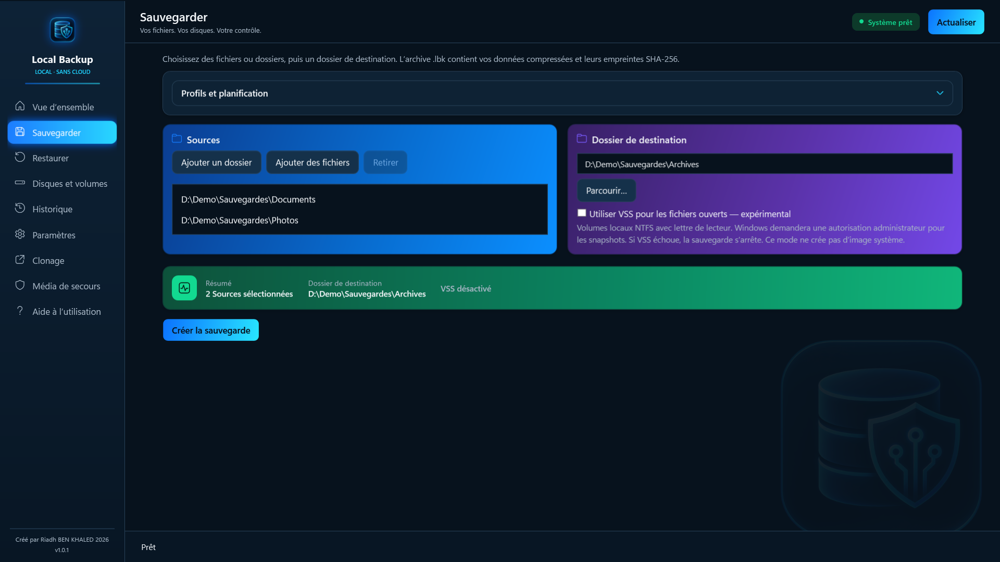
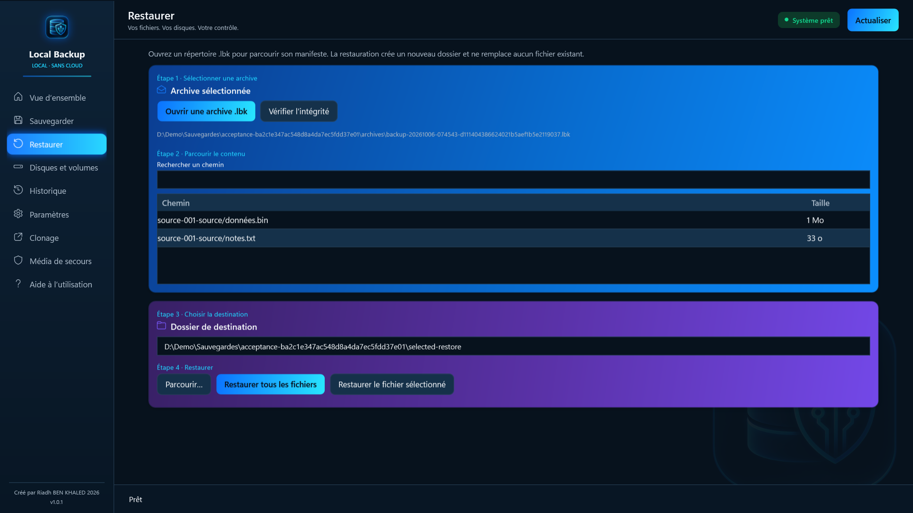
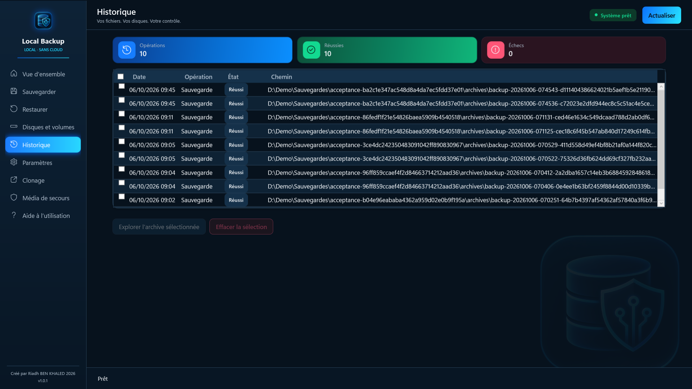
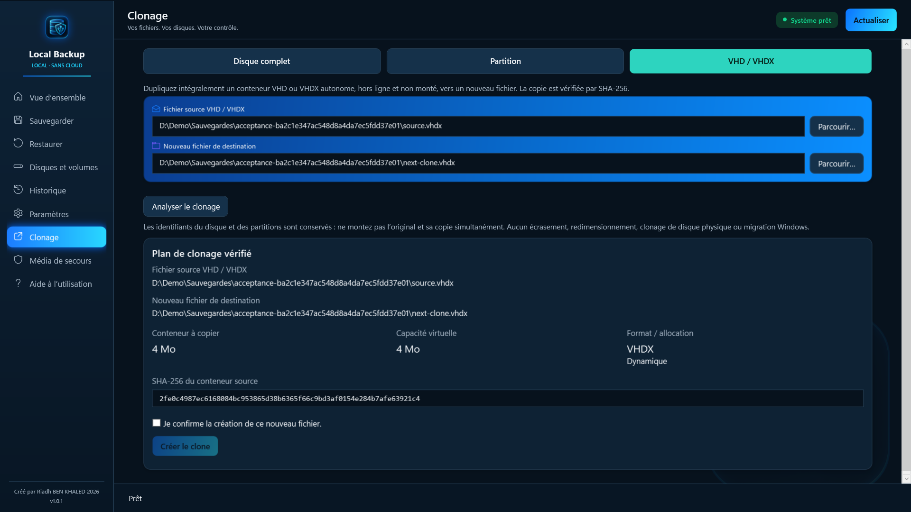
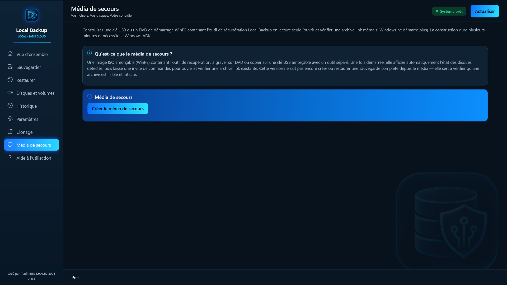
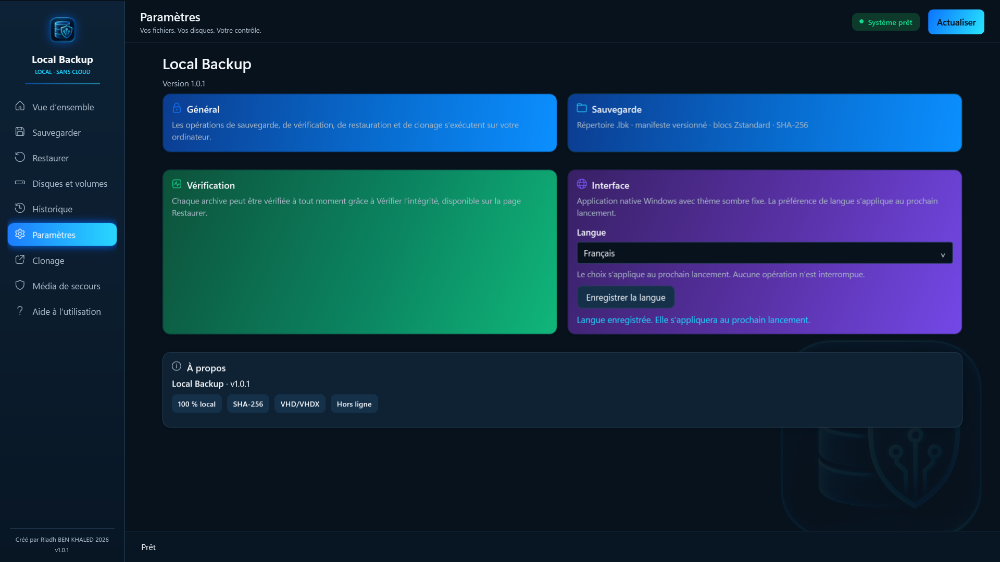

# Guide d'utilisation — Local Backup Pro

*English version: [GUIDE.md](GUIDE.md)*

Ce guide explique en détail le fonctionnement de Local Backup Pro et l'utilisation de chaque écran. Il correspond à la version 1.0.1 distribuée par le Microsoft Store.

## Sommaire

1. [Principes de fonctionnement](#1-principes-de-fonctionnement)
2. [Installation et premier lancement](#2-installation-et-premier-lancement)
3. [Démarrage rapide](#3-démarrage-rapide)
4. [Vue d'ensemble](#4-vue-densemble)
5. [Sauvegarder](#5-sauvegarder)
6. [Profils et planification](#6-profils-et-planification)
7. [Notifications et résultats](#7-notifications-et-résultats)
8. [Restaurer et vérifier](#8-restaurer-et-vérifier)
9. [Disques et volumes](#9-disques-et-volumes)
10. [Historique](#10-historique)
11. [Clonage](#11-clonage)
12. [Média de secours](#12-média-de-secours)
13. [Paramètres et langue](#13-paramètres-et-langue)
14. [Où sont mes données ?](#14-où-sont-mes-données-)
15. [Limites à connaître](#15-limites-à-connaître)
16. [Dépannage](#16-dépannage)
17. [Questions fréquentes](#17-questions-fréquentes)
18. [Bonnes pratiques](#18-bonnes-pratiques)

---

## 1. Principes de fonctionnement

Local Backup Pro copie vos fichiers dans une **archive `.lbk`** sur le support de votre choix. Tout se passe sur votre ordinateur : l'application ne se connecte pas à Internet, ne demande aucun compte et n'envoie aucune donnée.

**L'archive `.lbk` est un dossier**, pas un fichier unique. Il contient :

- un **manifeste** qui décrit chaque fichier sauvegardé (chemin, taille, date de modification, empreinte) ;
- des **blocs de données** compressés avec Zstandard ; un contenu identique présent plusieurs fois dans la même sauvegarde n'est stocké qu'une fois.

**Chaque sauvegarde est vérifiée avant d'être publiée.** L'application écrit d'abord l'archive dans un dossier temporaire (`.lbk-stage-…`), la relit entièrement, contrôle les empreintes **SHA-256** de chaque bloc et de chaque fichier, puis seulement la renomme en archive définitive. Une sauvegarde interrompue ou en erreur n'est jamais présentée comme réussie.

**La restauration ne remplace jamais un fichier existant.** Elle crée un nouveau dossier, écrit les fichiers, puis relit chacun d'eux pour vérifier qu'il correspond à l'empreinte d'origine.

## 2. Installation et premier lancement

- Windows 10 version 2004 (build 19041) ou plus récent, 64 bits. 4 Go de mémoire minimum, 8 Go recommandés.
- Installez l'application depuis le Microsoft Store. Aucune clé ni activation n'est nécessaire ; les mises à jour arrivent par le Store.
- Au lancement, l'application s'ouvre sur la **Vue d'ensemble**. L'interface est en français ; les boutons **FR / EN** en haut à droite changent la langue immédiatement.
- Si vous utilisiez une version précédente (« Local Backup AI »), votre historique, vos profils et vos préférences sont repris automatiquement.

## 3. Démarrage rapide

1. Branchez votre support de sauvegarde (disque externe, clé USB…) et vérifiez l'espace libre dans **Disques et volumes**.
2. Dans **Sauvegarder**, ajoutez vos fichiers ou dossiers et choisissez une destination **en dehors des sources**, idéalement sur un autre support physique.
3. Cliquez sur **Créer la sauvegarde** et attendez le message de fin.
4. Dans **Restaurer**, ouvrez le dossier `.lbk` créé et cliquez sur **Vérifier l’intégrité**.
5. Restaurez un fichier de test vers un autre dossier et ouvrez-le pour contrôler son contenu.

Conservez le dossier `.lbk` entier : ses fichiers internes forment une seule archive. Une sauvegarde vérifiée doit aussi être testée par une restauration.

## 4. Vue d'ensemble

La page d'accueil résume l'état de vos sauvegardes :

- **Sauvegardes** : nombre de sauvegardes réussies enregistrées dans l'historique.
- **Disques** : nombre de disques détectés par Windows.
- **Intégrité** : indique si des sauvegardes vérifiées existent.
- **Dernière opération** : date de la dernière action.
- **Dernière sauvegarde** : date, taille et durée.
- **Dernières opérations** : les cinq dernières actions avec leur état.

Ces compteurs reflètent l'historique ; ils ne garantissent pas que le support est toujours branché ni que l'archive n'a pas été modifiée depuis. Pour cela, utilisez **Vérifier l’intégrité**.

Les boutons **Créer la sauvegarde** et **Ouvrir une archive .lbk** mènent directement aux pages correspondantes. **Actualiser** relit l'historique et l'inventaire des disques.

## 5. Sauvegarder

1. **Sources** : cliquez sur **Ajouter un dossier** ou **Ajouter des fichiers**. Vous pouvez combiner plusieurs sources. Sélectionnez une ligne puis **Retirer** pour l'enlever.
2. **Dossier de destination** : cliquez sur **Parcourir…** et choisissez un dossier qui n'est pas à l'intérieur d'une source. Prévoyez assez d'espace libre.
3. **VSS** : laissez cette option désactivée pour un usage courant (voir ci-dessous).
4. Vérifiez le **résumé** (nombre de sources, destination, VSS), puis cliquez sur **Créer la sauvegarde**.

Pendant l'opération, la barre de progression affiche la phase en cours (analyse, compression, écriture, vérification, publication), les octets traités et la durée. **Annuler** demande l'arrêt : attendez que l'interface redevienne disponible. Ne débranchez pas le support avant le message de fin.

L'archive créée s'appelle `backup-AAAAMMJJ-HHMMSS-….lbk` dans le dossier de destination.

### Ce qui est sauvegardé

- Le contenu des fichiers, les dossiers (y compris vides) et la date de dernière modification.
- **Non conservés** : permissions NTFS (ACL), flux de données alternatifs, liens physiques et attributs avancés.
- **Refusés** : liens symboliques, jonctions et autres points d'analyse, fichiers chiffrés EFS, fichiers OneDrive « à la demande » non téléchargés.

### Fichiers ouverts et VSS (expérimental)

Sans VSS, un fichier ouvert en écriture par un autre programme ou qui change pendant la lecture fait échouer la sauvegarde : fermez le programme concerné et relancez.

L'option **Utiliser VSS pour les fichiers ouverts — expérimental** crée un cliché instantané Windows des volumes concernés et sauvegarde depuis ce cliché. Elle :

- demande une **autorisation administrateur** (fenêtre UAC) à chaque sauvegarde ;
- fonctionne uniquement sur des volumes locaux NTFS avec une lettre de lecteur ;
- arrête la sauvegarde si le cliché échoue (aucune archive partielle n'est publiée) ;
- n'est pas disponible pour les profils planifiés.

## 6. Profils et planification

Un profil mémorise des sources, une destination et une fréquence pour relancer la même sauvegarde sans tout ressaisir.

1. Dans **Sauvegarder**, préparez les sources et la destination.
2. Ouvrez **Profils et planification**, cliquez sur **Nouveau profil** et donnez-lui un nom explicite.
3. Choisissez la **fréquence** : manuelle, quotidienne ou hebdomadaire. Indiquez l'heure (0–23) et les minutes ; pour une fréquence hebdomadaire, choisissez le jour.
4. Cochez **Afficher une notification à la fin** si vous le souhaitez, puis cliquez sur **Enregistrer le profil**.

Pour réutiliser un profil : sélectionnez-le puis cliquez sur **Charger les chemins**. La simple sélection ne remplace pas les chemins en cours. **Exécuter le profil enregistré** le lance immédiatement.

**Conditions d'exécution d'une sauvegarde planifiée** : l'application peut être fermée, mais il faut une **session Windows ouverte**, le PC allumé et le support de destination accessible. Une tâche manquée (PC éteint) est relancée dès que possible quand la session est disponible. Aucun mot de passe n'est enregistré.

**Supprimer un profil** retire sa planification Windows sans supprimer les archives déjà créées.

## 7. Notifications et résultats

Si l'option est activée dans le profil, Windows affiche une notification à la fin de chaque exécution planifiée. Elle peut être masquée par le mode Ne pas déranger ou les réglages de notifications.

Le résultat réel se consulte dans **Sauvegarder › Profils et planification › Résultats des profils** : état, heure de fin, message et archive créée. **Marquer comme lus** retire l'indicateur des nouveaux résultats. L'absence de notification ne prouve ni une réussite ni un échec : consultez toujours le résultat enregistré.

## 8. Restaurer et vérifier

1. Cliquez sur **Ouvrir une archive .lbk** et sélectionnez le **dossier `.lbk` complet** (pas un fichier à l'intérieur).
2. La liste affiche le contenu de l'archive. Utilisez **Rechercher un chemin** pour filtrer.
3. Choisissez le **dossier de destination** avec **Parcourir…**. L'application propose un nouveau sous-dossier `Restore-AAAAMMJJ-HHMMSS`.
4. Cliquez sur **Restaurer tous les fichiers**, ou sélectionnez un fichier puis **Restaurer le fichier sélectionné**.
5. Attendez la confirmation, puis ouvrez les fichiers restaurés.

**Vérifier l’intégrité** relit tous les blocs de l'archive et recalcule les empreintes SHA-256, sans rien restaurer. Faites-le après avoir copié une archive vers un autre support, ou régulièrement sur vos sauvegardes anciennes.

En cas d'erreur d'intégrité : ne modifiez pas le contenu du dossier `.lbk`, conservez-le, lisez le message et utilisez une autre sauvegarde vérifiée.

## 9. Disques et volumes

Cette page affiche l'inventaire de Windows **en lecture seule** : elle ne formate et ne modifie rien.

Pour chaque disque : numéro, modèle, capacité, type de bus (USB, SATA, NVMe…), style de partitionnement (GPT/MBR) et état de santé. Pour chaque partition : lettre, nom, système de fichiers et barre d'occupation (espace utilisé et libre).

Utilisez **Actualiser** après avoir branché un support. Une lettre de lecteur peut changer quand vous reconnectez un disque : vérifiez-la avant de choisir une destination. Un bon état de santé ne remplace pas une sauvegarde.

## 10. Historique

L'historique liste les sauvegardes, restaurations, vérifications et clonages avec leur date, leur état et leur chemin, ainsi que les totaux (opérations, réussies, échecs).

- Sélectionnez une sauvegarde puis **Explorer l’archive sélectionnée** pour l'ouvrir dans Restaurer. Les entrées de clonage ne sont pas des archives.
- Cochez des lignes puis **Effacer la sélection** pour les retirer de l'historique. **Cela ne supprime pas les archives** sur le disque.
- Si une archive a été déplacée ou si le support est débranché, reconnectez-le ou ouvrez directement le nouvel emplacement depuis Restaurer.

## 11. Clonage

Trois modes, à choisir en haut de la page. Vérifiez toujours la source et la destination avant de confirmer.

### Fichier VHD / VHDX

Copie intégrale d'un fichier de disque virtuel autonome (fixe ou dynamique), **hors ligne et non monté**, vers un **nouveau fichier** du même format.

1. Choisissez le fichier source et le nouveau fichier de destination.
2. Cliquez sur **Analyser le clonage** : l'application affiche la taille, la capacité virtuelle, le format et l'empreinte SHA-256 de la source.
3. Cochez la confirmation, puis **Créer le clone**.

La copie est relue et comparée par SHA-256 avant d'être publiée ; le fichier source n'est pas modifié. Les disques différentiels ne sont pas pris en charge. Les identifiants de disque sont conservés : ne montez pas l'original et la copie en même temps.

### Disque complet (expérimental)

Copie d'un **disque secondaire hors ligne** vers un autre disque de capacité égale ou supérieure. **Tout le contenu du disque de destination est effacé.**

1. Dans la Gestion des disques de Windows, mettez les deux disques **hors ligne**.
2. Cliquez sur **Actualiser les disques — administrateur** (autorisation UAC).
3. Choisissez la source puis la destination en contrôlant le **numéro, le modèle et la capacité**.
4. Cliquez sur **Analyser le clonage physique** et lisez le plan.
5. Saisissez **exactement** la phrase de confirmation affichée (elle contient le numéro et l'identifiant du disque à effacer), puis cliquez sur **Effacer la destination et cloner**.

L'application relit toute la destination et compare son empreinte. Sur un disque GPT plus grand, la table de partitions de secours est déplacée en fin de disque ; les partitions gardent leur taille d'origine. Le disque Windows actif, les disques en ligne, BitLocker, les disques dynamiques et Storage Spaces sont refusés. Après la copie, déconnectez l'original avant d'utiliser le clone.

### Partition (expérimental)

Copie d'une partition compatible vers une **partition existante** d'un autre disque : **Actualiser les disques et partitions — administrateur**, choix de la source et de la destination, **Analyser le clonage de partition**, puis **Effacer la partition et cloner** après confirmation explicite. Le contenu de la partition de destination est effacé. Ce mode ne crée ni ne redimensionne de partition.

> Les modes physiques sont expérimentaux : faites vos premiers essais avec des supports de test sans données importantes.

## 12. Média de secours

Le média de secours est une **image ISO WinPE amorçable** contenant l'outil de récupération. Il permet d'ouvrir et de vérifier vos archives `.lbk` même si Windows ne démarre plus.

1. Installez le **Windows ADK** et son module **WinPE** depuis le site de Microsoft. Si l'application ne les détecte pas, elle l'indique ; cliquez sur **Vérifier à nouveau** après installation.
2. Ouvrez **Média de secours** et cliquez sur **Créer le média de secours**. La construction demande une autorisation administrateur et dure plusieurs minutes ; le journal affiche chaque étape.
3. Copiez l'ISO sur une clé USB amorçable avec un outil séparé, ou gravez-la sur DVD.
4. **Testez le démarrage** sur votre PC avant d'en avoir besoin.

Au démarrage, l'outil affiche l'état des disques détectés puis une invite de commandes. Commandes principales : `status` et `disks` pour consulter les disques, `manifest` pour lister le contenu d'une archive, `verify` pour vérifier son intégrité. L'aide de chaque commande affiche ses arguments ; l'option `--language fr` ou `--language en` choisit la langue.

Le média ne clone pas le Windows actif et ne restaure pas une image système complète.

## 13. Paramètres et langue

- **À propos** : nom et version de l'application. Indiquez cette version quand vous signalez un problème.
- **Interface › Langue** : choisissez Français ou English puis **Enregistrer la langue** ; le choix s'applique au prochain lancement.
- **Changement immédiat** : utilisez les boutons **FR / EN** de la Vue d'ensemble. Les chemins et saisies en cours sont conservés. Ces boutons sont désactivés pendant une opération.

Changer de langue ne renomme aucun fichier et ne modifie pas le format des archives. Les anciens messages restent dans la langue de leur création.

L'**Aide à l'utilisation** intégrée reprend ces explications par rubrique.

## 14. Où sont mes données ?

| Élément | Emplacement |
|---|---|
| Archives `.lbk` | Les dossiers de destination que vous choisissez |
| Historique (catalogue) | `%LOCALAPPDATA%\LocalBackup\catalog.db` |
| Profils planifiés | `%LOCALAPPDATA%\LocalBackup\automation.db` et Planificateur de tâches Windows (tâches `LocalBackup.…`) |
| Journal technique | `%LOCALAPPDATA%\LocalBackup\logs\operations.jsonl` |
| Langue | `%LOCALAPPDATA%\LocalBackup\language.json` |

**Désinstallation** : supprimez d'abord vos profils dans l'application pour retirer leurs tâches planifiées, puis désinstallez depuis Paramètres Windows. Vos archives et le dossier `%LOCALAPPDATA%\LocalBackup` restent sur le disque ; supprimez-les manuellement si vous le souhaitez.

## 15. Limites à connaître

- Pas de chiffrement des archives : protégez l'accès au support de sauvegarde.
- Pas de sauvegarde incrémentielle ou différentielle : chaque sauvegarde est complète.
- Pas d'image système ni de clonage du Windows en cours d'exécution.
- Limites par archive : 100 000 éléments, manifeste de 32 Mo, 1 000 000 de références de blocs.
- Après un échec ou une annulation, un dossier `.lbk-stage-…` peut rester sur le support. Il n'est jamais nettoyé automatiquement, par sécurité ; vérifiez-le avant de le supprimer à la main.
- Les empreintes SHA-256 détectent la corruption accidentelle ; elles ne sont pas une signature contre une modification volontaire du manifeste et des données.

## 16. Dépannage

| Symptôme | Que faire |
|---|---|
| Destination inaccessible ou espace insuffisant | Reconnectez le support, vérifiez le chemin et l'espace libre dans Disques et volumes, puis relancez. |
| « Fichier en cours d'utilisation » | Fermez le programme qui utilise le fichier, ou essayez l'option VSS (administrateur). |
| Erreur VSS | Lisez le message et vérifiez l'autorisation administrateur. Pour des fichiers que vous pouvez fermer, sauvegardez sans VSS. |
| Profil non exécuté | Vérifiez l'état de planification, la session Windows ouverte, le PC allumé et la destination accessible ; actualisez les résultats. |
| Pas de notification | Vérifiez l'option du profil et les réglages de notifications Windows ; consultez les résultats enregistrés. |
| Changement de langue impossible | Attendez la fin de l'opération en cours. |
| Archive illisible ou vérification en échec | Vérifiez que le dossier `.lbk` est complet et accessible. Ne modifiez pas son contenu. Utilisez une autre sauvegarde vérifiée. |
| Média de secours : ADK manquant | Installez le Windows ADK et son module WinPE, puis cliquez sur Vérifier à nouveau. |

Pour signaler un problème, [ouvrez un ticket](https://github.com/Riadh35/local-backup-pro/issues) avec la version de Windows, la version de l'application, l'action effectuée, le message exact et le résultat attendu. Ne partagez ni mots de passe ni fichiers personnels.

## 17. Questions fréquentes

**Une archive `.lbk` est-elle un fichier unique ?**
Non, c'est un dossier. Copiez ou déplacez toujours le dossier entier, puis vérifiez-le après transfert.

**Puis-je ouvrir une archive sur un autre PC ?**
Oui, avec Local Backup Pro installé sur cet autre PC (ou le média de secours pour la vérifier).

**Une vérification réussie suffit-elle ?**
Elle confirme que les données stockées sont intactes. Testez aussi une restauration et conservez plusieurs sauvegardes sur des supports distincts.

**Mes données quittent-elles l'ordinateur ?**
Non. L'application n'a aucune connexion réseau.

**Faut-il laisser l'application ouverte pour les sauvegardes planifiées ?**
Non, mais la session Windows doit être ouverte et le support de destination branché.

**Supprimer une ligne de l'historique supprime-t-il la sauvegarde ?**
Non. Les archives restent sur le disque.

## 18. Bonnes pratiques

- Appliquez la règle **3-2-1** : trois copies de vos données, sur deux supports différents, dont une hors de votre domicile.
- Sauvegardez vers un support **physiquement distinct** du disque source.
- **Vérifiez** régulièrement vos archives et **testez une restauration** de temps en temps.
- Débranchez le disque de sauvegarde quand il ne sert pas : il est ainsi protégé contre les incidents et les logiciels malveillants.
- Préparez et testez votre **média de secours** avant d'en avoir besoin.

---

© 2026 Riadh BEN KHALED · [Politique de confidentialité](PRIVACY.md) · [Assistance](https://github.com/Riadh35/local-backup-pro/issues)
