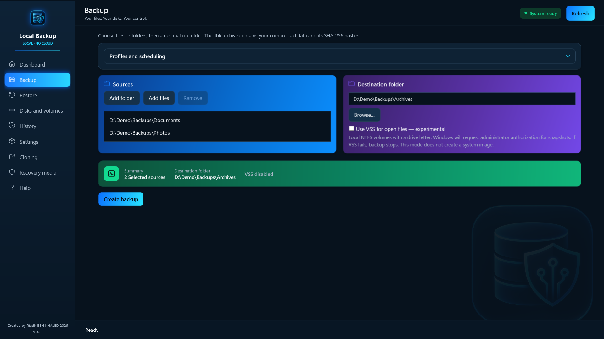
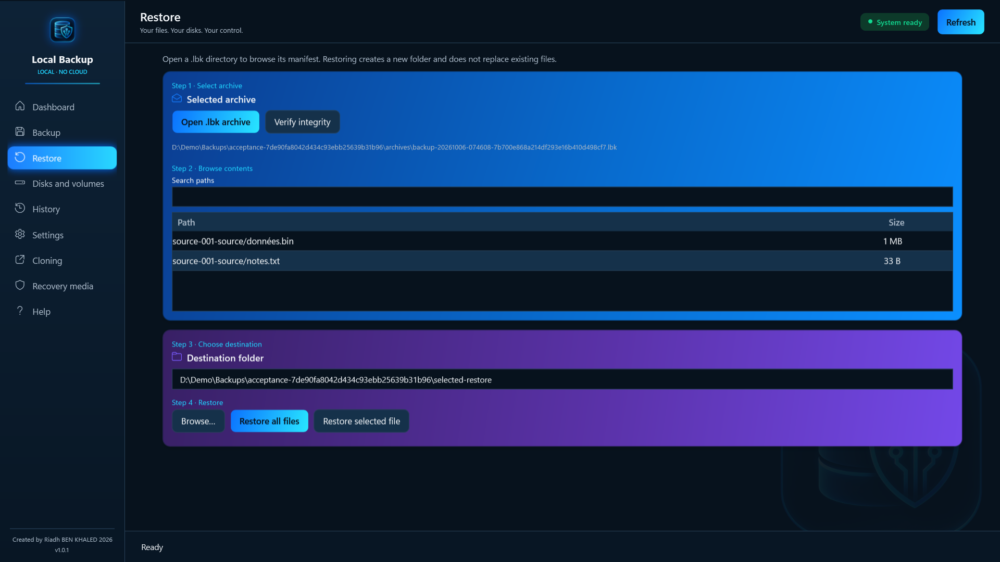
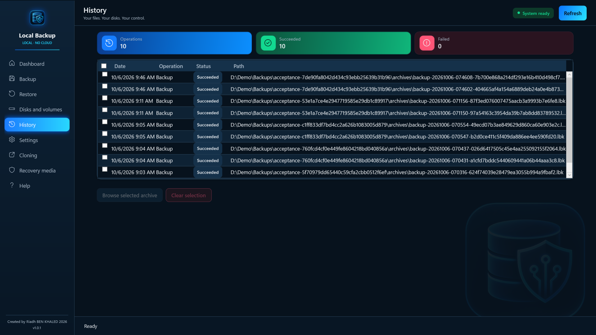
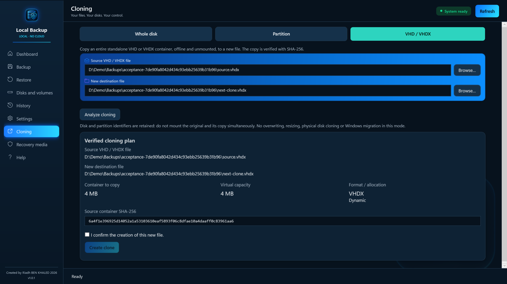
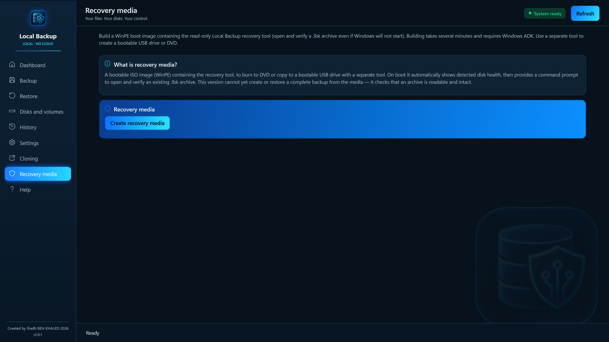
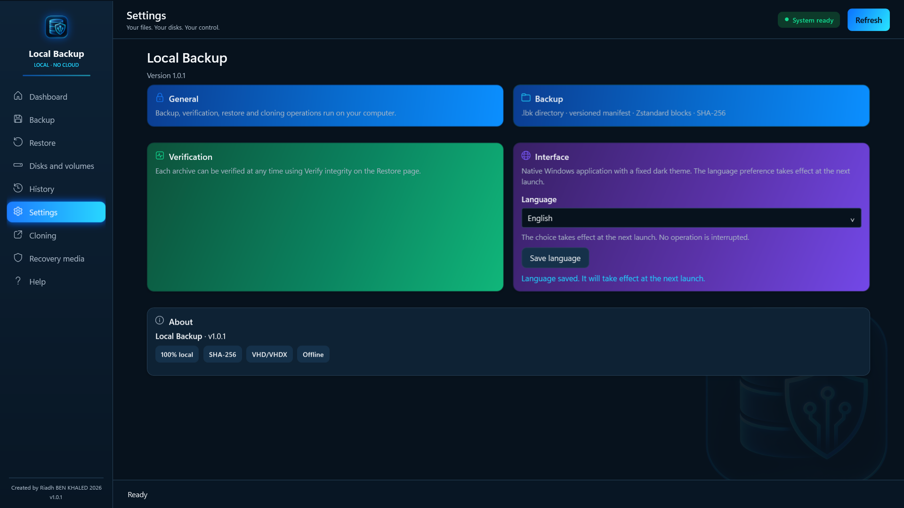

# User guide — Local Backup Pro

*Version française : [GUIDE.fr.md](GUIDE.fr.md)*

This guide explains in detail how Local Backup Pro works and how to use each screen. It covers version 1.0.1 distributed through the Microsoft Store.

## Contents

1. [How it works](#1-how-it-works)
2. [Installation and first launch](#2-installation-and-first-launch)
3. [Quick start](#3-quick-start)
4. [Dashboard](#4-dashboard)
5. [Backup](#5-backup)
6. [Profiles and scheduling](#6-profiles-and-scheduling)
7. [Notifications and results](#7-notifications-and-results)
8. [Restore and verify](#8-restore-and-verify)
9. [Disks and volumes](#9-disks-and-volumes)
10. [History](#10-history)
11. [Cloning](#11-cloning)
12. [Recovery media](#12-recovery-media)
13. [Settings and language](#13-settings-and-language)
14. [Where is my data?](#14-where-is-my-data)
15. [Known limits](#15-known-limits)
16. [Troubleshooting](#16-troubleshooting)
17. [FAQ](#17-faq)
18. [Good practices](#18-good-practices)

---

## 1. How it works

Local Backup Pro copies your files into a **`.lbk` archive** on the drive you choose. Everything happens on your computer: the app does not connect to the Internet, requires no account and sends no data.

**A `.lbk` archive is a folder**, not a single file. It contains:

- a **manifest** describing every backed-up file (path, size, modification date, fingerprint);
- **data blocks** compressed with Zstandard; identical content found several times in the same backup is stored only once.

**Every backup is verified before it is published.** The app first writes the archive to a temporary folder (`.lbk-stage-…`), reads it back entirely, checks the **SHA-256** fingerprints of every block and file, and only then renames it into the final archive. An interrupted or failed backup is never presented as successful.

**Restoring never replaces an existing file.** It creates a new folder, writes the files, then reads each one back to check that it matches its original fingerprint.

## 2. Installation and first launch

- Windows 10 version 2004 (build 19041) or later, 64-bit. 4 GB RAM minimum, 8 GB recommended.
- Install the app from the Microsoft Store. No key or activation is needed; updates are delivered by the Store.
- The app opens on the **Dashboard**. Use the **FR / EN** buttons at the top right to switch language instantly.
- If you used an earlier version ("Local Backup AI"), your history, profiles and preferences are picked up automatically.

## 3. Quick start

1. Connect your backup device (external disk, USB drive…) and check its free space in **Disks and volumes**.
2. In **Backup**, add your files or folders and choose a destination **outside the sources**, ideally on another physical device.
3. Click **Create backup** and wait for the completion message.
4. In **Restore**, open the new `.lbk` folder and click **Verify integrity**.
5. Restore a test file to another folder and open it to check its content.

Keep the whole `.lbk` folder: its internal files form a single archive. A verified backup should also be tested by restoring.

## 4. Dashboard

The home page summarizes your backups:

- **Backups**: number of successful backups recorded in the history.
- **Disks**: number of disks detected by Windows.
- **Integrity**: shows whether verified backups exist.
- **Last operation**: date of the latest action.
- **Last backup**: date, size and duration.
- **Recent operations**: the five latest actions and their status.

These counters reflect the history; they do not guarantee that the device is still connected or that the archive has not changed since. Use **Verify integrity** for that.

**Create backup** and **Open .lbk archive** lead to the matching pages. **Refresh** reloads the history and disk inventory.

## 5. Backup

1. **Sources**: click **Add folder** or **Add files**. You can combine several sources. Select a line and click **Remove** to take it out.
2. **Destination folder**: click **Browse…** and pick a folder that is not inside a source. Make sure there is enough free space.
3. **VSS**: leave this option off for everyday use (see below).
4. Check the **summary** (number of sources, destination, VSS) and click **Create backup**.

During the operation, the progress bar shows the current phase (scan, compression, writing, verification, publishing), the bytes processed and the elapsed time. **Cancel** requests a stop: wait until the interface is available again. Do not disconnect the device before the completion message.

The new archive is named `backup-YYYYMMDD-HHMMSS-….lbk` in the destination folder.

### What is backed up

- File contents, folders (including empty ones) and last modification dates.
- **Not preserved**: NTFS permissions (ACLs), alternate data streams, hard links and advanced attributes.
- **Refused**: symbolic links, junctions and other reparse points, EFS-encrypted files, OneDrive "on-demand" files that are not downloaded.

### Open files and VSS (experimental)

Without VSS, a file opened for writing by another program, or one that changes while it is read, makes the backup fail: close that program and try again.

The **Use VSS for open files — experimental** option creates a Windows shadow copy of the volumes involved and backs up from that snapshot. It:

- asks for **administrator approval** (UAC prompt) for each backup;
- only works on local NTFS volumes with a drive letter;
- stops the backup if the snapshot fails (no partial archive is published);
- is not available for scheduled profiles.

## 6. Profiles and scheduling

A profile stores sources, a destination and a frequency so you can run the same backup again without re-entering everything.

1. In **Backup**, set up the sources and destination.
2. Open **Profiles and scheduling**, click **New profile** and give it a clear name.
3. Choose the **frequency**: manual, daily or weekly. Set the hour (0–23) and minutes; for weekly, choose the day.
4. Tick **Show a notification when finished** if you wish, then click **Save profile**.

To reuse a profile, select it and click **Load paths**. Selecting it alone does not replace the current paths. **Run saved profile** starts it immediately.

**Conditions for a scheduled backup to run**: the app can be closed, but a **Windows session must be signed in**, the PC must be on and the destination must be reachable. A missed run (PC off) starts as soon as possible once the session is available. No password is stored.

**Deleting a profile** removes its Windows schedule without deleting the archives already created.

## 7. Notifications and results

When enabled in the profile, Windows shows a notification at the end of each scheduled run. It can be hidden by Do Not Disturb or by your notification settings.

The actual result is shown in **Backup › Profiles and scheduling › Profile results**: status, end time, message and archive created. **Mark as read** clears the unread indicator. A missing notification proves neither success nor failure: always check the recorded result.

## 8. Restore and verify

1. Click **Open .lbk archive** and select the **whole `.lbk` folder** (not a file inside it).
2. The list shows the archive contents. Use **Search paths** to filter.
3. Choose the **destination folder** with **Browse…**. The app proposes a new `Restore-YYYYMMDD-HHMMSS` subfolder.
4. Click **Restore all files**, or select a file and click **Restore selected file**.
5. Wait for the confirmation, then open the restored files.

**Verify integrity** reads every block of the archive and recomputes the SHA-256 fingerprints without restoring anything. Do it after copying an archive to another device, and regularly on older backups.

If the integrity check fails: do not modify the `.lbk` folder, keep it, read the message and use another verified backup.

## 9. Disks and volumes

This page shows the Windows inventory **read-only**: it never formats or changes anything.

For each disk: number, model, capacity, bus type (USB, SATA, NVMe…), partition style (GPT/MBR) and health. For each partition: drive letter, label, file system and a usage bar (used and free space).

Use **Refresh** after connecting a device. A drive letter can change when you reconnect a disk: check it before choosing a destination. Good health does not replace a backup.

## 10. History

The history lists backups, restores, verifications and clones with their date, status and path, plus totals (operations, succeeded, failed).

- Select a backup and click **Browse selected archive** to open it in Restore. Clone entries are not archives.
- Tick lines and click **Clear selection** to remove them from the history. **This does not delete the archives** on disk.
- If an archive was moved or the device is disconnected, reconnect it or open the new location directly from Restore.

## 11. Cloning

Three modes, chosen at the top of the page. Always check the source and destination before confirming.

### VHD / VHDX file

Full copy of a standalone virtual disk file (fixed or dynamic), **offline and not mounted**, to a **new file** of the same format.

1. Choose the source file and the new destination file.
2. Click **Analyze cloning**: the app shows the size, virtual capacity, format and SHA-256 fingerprint of the source.
3. Tick the confirmation and click **Create clone**.

The copy is read back and compared with SHA-256 before it is published; the source file is not modified. Differencing disks are not supported. Disk identifiers are kept: do not mount the original and the copy at the same time.

### Whole disk (experimental)

Copies an **offline secondary disk** to another disk of equal or greater capacity. **Everything on the destination disk is erased.**

1. In Windows Disk Management, set both disks **offline**.
2. Click **Refresh disks — administrator** (UAC approval).
3. Choose the source, then the destination, checking the **number, model and capacity**.
4. Click **Analyze physical cloning** and read the plan.
5. Type **exactly** the confirmation phrase shown (it contains the number and identifier of the disk to erase), then click **Erase destination and clone**.

The app reads back the whole destination and compares its fingerprint. On a larger GPT disk, the backup partition table is moved to the end of the disk; partitions keep their original size. The active Windows disk, online disks, BitLocker, dynamic disks and Storage Spaces are refused. After cloning, disconnect the original before using the clone.

### Partition (experimental)

Copies a compatible partition to an **existing partition** on another disk: **Refresh disks and partitions — administrator**, choose source and destination, **Analyze partition cloning**, then **Erase partition and clone** after explicit confirmation. The destination partition's content is erased. This mode does not create or resize partitions.

> Physical modes are experimental: make your first attempts with test devices that hold no important data.

## 12. Recovery media

The recovery media is a **bootable WinPE ISO image** containing the recovery tool. It lets you open and verify your `.lbk` archives even when Windows no longer starts.

1. Install the **Windows ADK** and its **WinPE** add-on from Microsoft's website. If the app does not detect them, it says so; click **Check again** after installing.
2. Open **Recovery media** and click **Create recovery media**. The build asks for administrator approval and takes several minutes; the build log shows each step.
3. Copy the ISO to a bootable USB drive with a separate tool, or burn it to a DVD.
4. **Test booting** your PC from it before you need it.

At startup, the tool shows the detected disks, then a command prompt. Main commands: `status` and `disks` to inspect disks, `manifest` to list an archive's contents, `verify` to check its integrity. Each command's help lists its arguments; `--language fr` or `--language en` chooses the language.

The media does not clone the running Windows and does not restore a full system image.

## 13. Settings and language

- **About**: application name and version. Include this version when you report a problem.
- **Interface › Language**: choose Français or English and click **Save language**; the choice applies at the next launch.
- **Instant switch**: use the **FR / EN** buttons on the Dashboard. Current paths and entries are kept. These buttons are disabled during an operation.

Switching language renames no files and does not change the archive format. Older messages stay in the language they were created in.

The built-in **Help** page repeats these explanations by topic.

## 14. Where is my data?

| Item | Location |
|---|---|
| `.lbk` archives | The destination folders you choose |
| History (catalog) | `%LOCALAPPDATA%\LocalBackup\catalog.db` |
| Scheduled profiles | `%LOCALAPPDATA%\LocalBackup\automation.db` and Windows Task Scheduler (`LocalBackup.…` tasks) |
| Technical log | `%LOCALAPPDATA%\LocalBackup\logs\operations.jsonl` |
| Language | `%LOCALAPPDATA%\LocalBackup\language.json` |

**Uninstalling**: first delete your profiles in the app to remove their scheduled tasks, then uninstall from Windows Settings. Your archives and the `%LOCALAPPDATA%\LocalBackup` folder stay on disk; delete them manually if you wish.

## 15. Known limits

- No archive encryption: protect access to your backup device.
- No incremental or differential backups: every backup is complete.
- No system image and no cloning of the running Windows.
- Per-archive limits: 100,000 entries, 32 MB manifest, 1,000,000 block references.
- After a failure or cancellation, a `.lbk-stage-…` folder may remain on the device. For safety it is never cleaned automatically; check it before deleting it by hand.
- SHA-256 fingerprints detect accidental corruption; they are not a signature against deliberate changes to both the manifest and the data.

## 16. Troubleshooting

| Symptom | What to do |
|---|---|
| Destination unreachable or not enough space | Reconnect the device, check the path and free space in Disks and volumes, then try again. |
| "File in use" | Close the program using the file, or try the VSS option (administrator). |
| VSS error | Read the message and check the administrator approval. For files you can close, back up without VSS. |
| Profile did not run | Check the schedule status, a signed-in Windows session, the PC being on and the destination being reachable; refresh the results. |
| No notification | Check the profile option and Windows notification settings; read the recorded results. |
| Cannot switch language | Wait for the current operation to finish. |
| Unreadable archive or failed verification | Check that the `.lbk` folder is complete and accessible. Do not modify its contents. Use another verified backup. |
| Recovery media: ADK missing | Install the Windows ADK and its WinPE add-on, then click Check again. |

To report a problem, [open an issue](https://github.com/Riadh35/local-backup-pro/issues) with your Windows version, the app version, what you did, the exact message and the expected result. Never share passwords or personal files.

## 17. FAQ

**Is a `.lbk` archive a single file?**
No, it is a folder. Always copy or move the whole folder, then verify it after the transfer.

**Can I open an archive on another PC?**
Yes, with Local Backup Pro installed on that PC (or the recovery media to verify it).

**Is a successful verification enough?**
It confirms that the stored data is intact. Also test a restore and keep several backups on separate devices.

**Does my data leave my computer?**
No. The app has no network connection.

**Must the app stay open for scheduled backups?**
No, but the Windows session must be signed in and the destination device connected.

**Does removing a history line delete the backup?**
No. Archives stay on disk.

## 18. Good practices

- Follow the **3-2-1** rule: three copies of your data, on two different media, one of them off-site.
- Back up to a device **physically separate** from the source disk.
- **Verify** your archives regularly and **test a restore** from time to time.
- Disconnect the backup disk when not in use: it is then protected from incidents and malware.
- Prepare and test your **recovery media** before you need it.

---

© 2026 Riadh BEN KHALED · [Privacy policy](PRIVACY.md) · [Support](https://github.com/Riadh35/local-backup-pro/issues)
