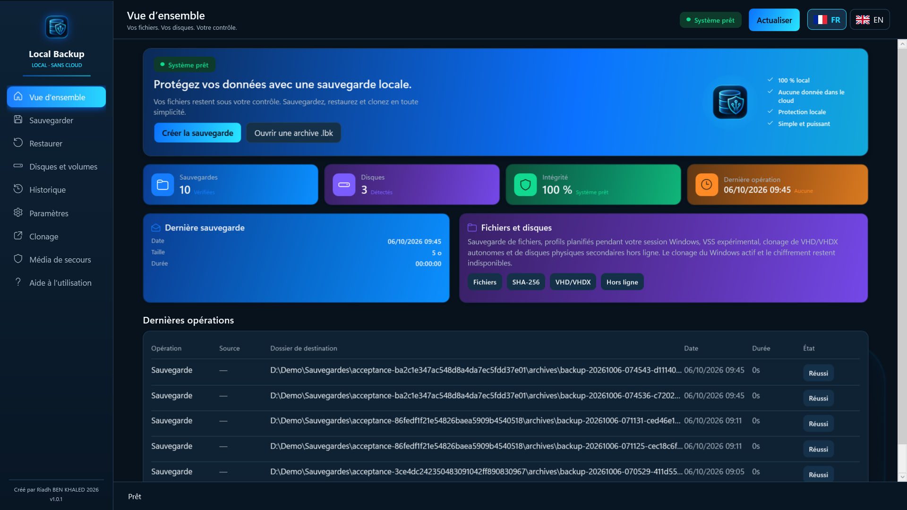

# Local Backup Pro

**Sauvegardes locales et vérifiées pour Windows — sans cloud, sans abonnement.**

[Disponible sur le Microsoft Store](https://apps.microsoft.com/detail/9PHLZ9V5P39M) · [English](README.md) · [Politique de confidentialité](PRIVACY.md) · [Assistance](https://github.com/Riadh35/local-backup-pro/issues)

## Ce que fait l'application

Local Backup Pro copie vos fichiers et dossiers dans des archives compressées, sur le support de votre choix : disque externe, autre volume ou partage réseau associé à une lettre de lecteur. Vos données ne quittent jamais votre ordinateur : aucun compte, aucune télémétrie, aucune connexion Internet.

- **Sauvegardes vérifiées** — chaque archive est relue et contrôlée par empreinte SHA-256 avant d'être publiée.
- **Restauration sûre** — restaurez tout ou un seul fichier vers un nouveau dossier ; aucun fichier existant n'est écrasé.
- **Vérification à la demande** — revérifiez une archive à tout moment.
- **Profils planifiés** — sauvegardes automatiques pendant votre session Windows, avec notification et historique des résultats.
- **Clonage VHD/VHDX** — copie de fichiers de disques virtuels autonomes, avec vérification.
- **Média de secours** — clé USB ou ISO WinPE pour ouvrir et vérifier vos archives même si Windows ne démarre plus (Windows ADK requis).
- **Interface en français et en anglais.**

Fonctions expérimentales, signalées dans l'application : capture VSS des fichiers ouverts et clonage de disques ou partitions secondaires hors ligne. Elles demandent une autorisation administrateur à chaque utilisation et refusent toujours le disque système.

## Configuration requise

- Windows 10 version 2004 (build 19041) ou plus récent, 64 bits
- 4 Go de mémoire minimum, 8 Go recommandés
- Achat unique sur le Microsoft Store ; les mises à jour arrivent par le Store

## Confidentialité

L'application n'établit aucune connexion réseau et ne collecte aucune donnée. Sauvegardes, historique et paramètres restent sur votre ordinateur, dans `%LOCALAPPDATA%\LocalBackup` et dans les dossiers que vous choisissez. Voir la [politique de confidentialité](PRIVACY.md).

## Assistance

[Ouvrez un ticket](https://github.com/Riadh35/local-backup-pro/issues) en indiquant votre version de Windows, la version de l'application (affichée dans Paramètres), les étapes pour reproduire le problème et le message d'erreur. Retirez les chemins personnels et données sensibles des journaux et captures. Les tickets en français et en anglais sont bienvenus.

---

© 2026 Riadh BEN KHALED
