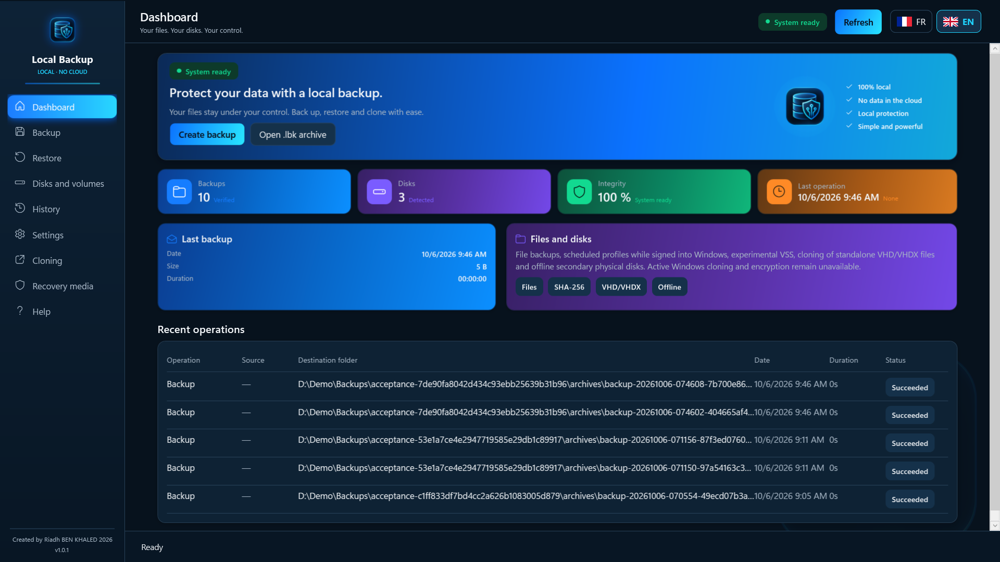

# Local Backup Pro

**Local, verified backups for Windows — no cloud, no subscription.**

[Get it from the Microsoft Store](https://apps.microsoft.com/detail/9PHLZ9V5P39M) · [Français](README.fr.md) · [Privacy policy](PRIVACY.md) · [Support](https://github.com/Riadh35/local-backup-pro/issues)

## What it does

Local Backup Pro copies your files and folders into compressed archives on the drive you choose — an external disk, another volume or a network share mapped to a drive letter. Your data never leaves your computer: no account, no telemetry, no Internet connection.

- **Verified backups** — every archive is read back and checked with SHA-256 fingerprints before it is published.
- **Safe restore** — restore everything or a single file to a new folder; existing files are never overwritten.
- **Integrity check on demand** — re-verify any archive at any time.
- **Scheduled profiles** — automatic backups during your Windows session, with notifications and a result history.
- **VHD/VHDX cloning** — copy standalone virtual disk files and verify the copy.
- **Recovery media** — build a WinPE USB/ISO to open and verify archives even if Windows no longer starts (requires the Windows ADK).
- **French and English interface.**

Experimental features (clearly marked in the app): VSS snapshots of open files and cloning of offline secondary disks or partitions. They ask for administrator approval every time and always refuse the system disk.

## Requirements

- Windows 10 version 2004 (build 19041) or later, 64-bit
- 4 GB RAM minimum, 8 GB recommended
- One-time purchase through the Microsoft Store; updates are delivered by the Store

## Privacy

The app makes no network connection and collects no data. Backups, history and settings stay on your computer in `%LOCALAPPDATA%\LocalBackup` and in the folders you choose. See the [privacy policy](PRIVACY.md).

## Support

[Open an issue](https://github.com/Riadh35/local-backup-pro/issues) with your Windows version, the app version (shown in Settings), the steps to reproduce and the error message. Remove personal paths and sensitive data from logs and screenshots. English and French reports are welcome.

---

© 2026 Riadh BEN KHALED
